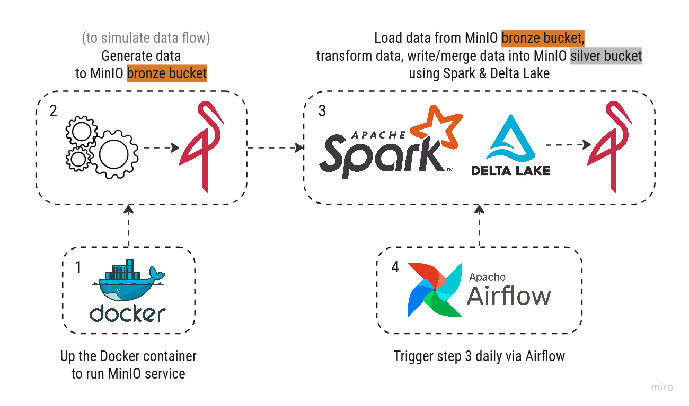
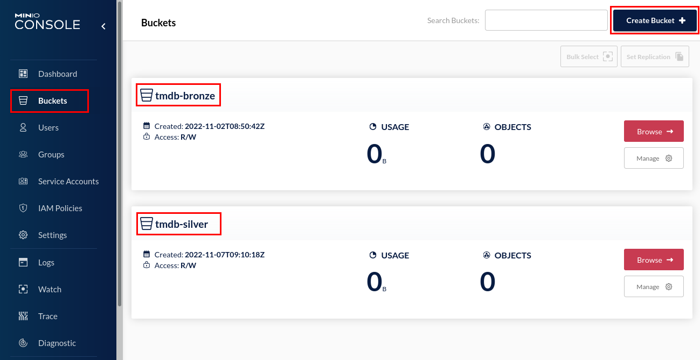
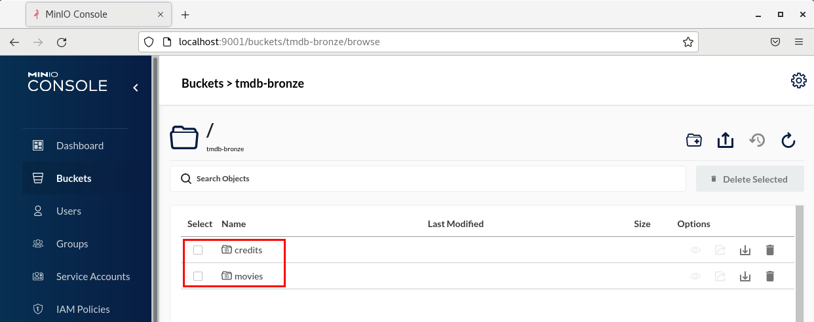
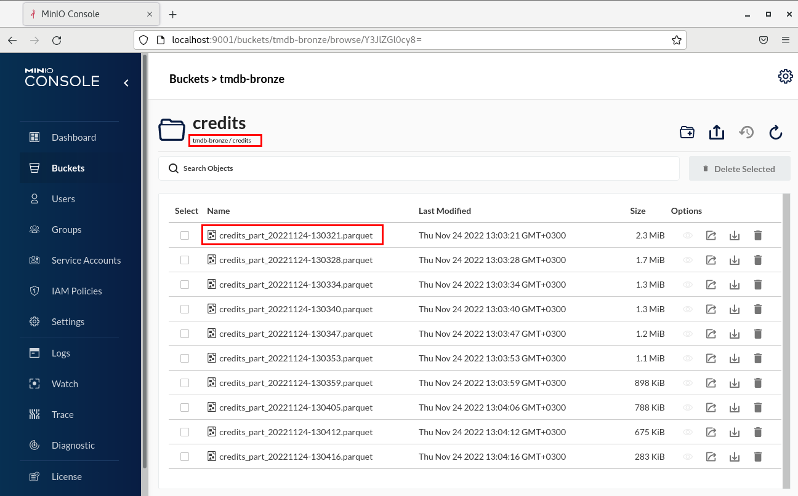
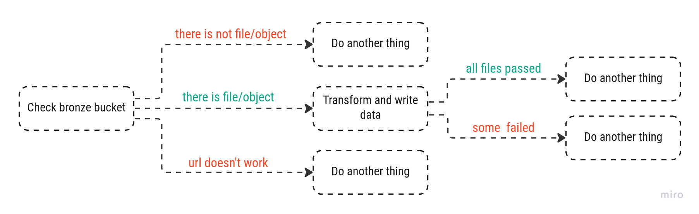
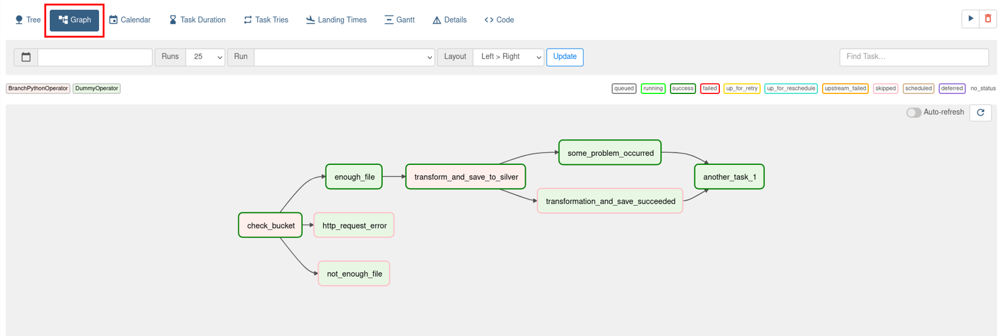
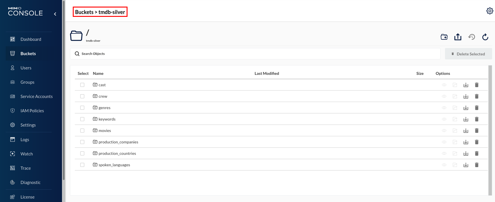

### Abstract

In data driven organizations, huge amount of data need to be organized,simplified or enriched when needed to gain insight from these various of raw and complex data. 

ETL (Extract, Transform, Load) concept break down the large-scale data and make it easy for the data scientists/analysts to access and analyze data, and turn it into business intelligence. At the same time, ETL refers to a specific type of data pipeline. To define in general, a data pipeline is a series of data processing steps that generally starts with ingestion of data and which each step delivers an output that is the input to the next step. 

**The purpose of this ETL case study** is to load raw data from an object storage that services via a containerization platform, transform the data with an analytics engine, store it in another object storage sink using a storage layer, and trigger the operation daily with an orchestration platform. As a result, this automated system aims to make it possible to make more informed decisions in less time.

**Keywords**: ETL (Extract, Transform, Load), Data Pipeline, Containerization, Storage layer, Orchestration, Object storage

### Case Study Statement | Movies & Credits data

In this case, data analysts need some advanced analytics on movies data to answer some questions. 
- Which is the highest-grossing movie starring Sam Worthington?
- What is the relationship between movie genres and box office revenue?
- What is the relationship between release dates and revenue?
- Does a director always work with the same crew?
- As a crew, which movie sets and roles Ahmet has been involved in throughout his career?

We are expected to make it easily queryable with SQL language by processing raw data.

Please check the file **"expected_outputs.ipynb"** to see the expected format of outputs that'll be stored in object storage.

### Used technologies & services

* Apache Spark <span style="color:gray"> (Unified Analytics Engine)</span>
* Apache Airflow <span style="color:gray">(Workflow/Orchestration Platform)</span>
* MinIO <span style="color:gray">(AWS S3 Compatible Object Storage)</span>
* Delta Lake <span style="color:gray">(Storage Layer)</span>
* Docker <span style="color:gray">(Delivery/Containerization Platform)</span>


---

* OS: Centos7
* IDE: PyCharm

Note: It is assumed that you have Apache Spark, Apache Airflow and Docker and AWS CLI. Please check the [requirements.txt](https://github.com/ElifSinemAktas/data_transformation_with_spark/blob/main/bronze_to_silver_data_transformation/requirements.txt) and install the packages before starting.

### Steps of the project



#### 1. Up the Docker container to run MinIO service

- Start docker and use the **"docker-compose.yml"** file that is prepared for minIO service. In the directory where the .yaml file is saved, run the following code using the terminal.

```bash 
sudo systemctl start docker
```
```bash
cd /<location_of_docker_compose.yaml>/ && docker-compose up -d 
```

#### 2. Generate data to MinIO bronze bucket


This step simulates data flow to our bronze bucket of object storage.

- When the container is running, go to the MinIO web UI with [this URL](http://localhost:9001/) (using 9001 port) and create an account.  In this case, we can use the "root" as username and "root12345" as password. 


- Create "tmdb-bronze" and "tmdb-silver" buckets. 
<br>We will use the silver bucket to store refined data later.</br>


We'll work on tmdb_5000_credits.csv and tmdb_5000_movies.csv datasets for this study. 

- Import & unzip "tmdb_5000_movies_and_credits.zip" file located [in this repo](https://github.com/ElifSinemAktas/datasets) that has been forked from [erkansirin78](https://github.com/erkansirin78). Many thanks to him for sharing these valuable datasets.</br>

```bash
wget -O /<your_file_location_to_save> https://github.com/ElifSinemAktas/datasets/blob/master/tmdb_5000_movies_and_credits.zip?raw=true
```

```bash
unzip tmdb_5000_movies_and_credits.zip
```

- Follow the steps which is explained [in this repo](https://github.com/ElifSinemAktas/data-generator) to use "data-generator". 
This repo has been forked from [erkansirin78](https://github.com/erkansirin78). Many thanks to him since this script successfully simulates a streaming data.

* In the directory where the data-generator files are saved, run the following codes using terminal to start data-generator and write the data to MinIO bronze bucket.

```bash
python dataframe_to_s3.py -buc tmdb-bronze \
-k credits/credits_part \
-aki root -sac root12345 \
-eu http://localhost:9000 \
-i /<tmdb_file_location>/tmdb_5000_credits.csv \
-ofp True -z 500 -b 0.1
```

```bash
python dataframe_to_s3.py -buc tmdb-bronze \
-k   movies/movies_part \
-aki root -sac root12345 \
-eu http://localhost:9000 \
-i /<tmdb_file_location>/tmdb_5000_movies.csv \
-ofp True -z 500 -b 0.1
```

And here we go! We have objects in our bronze bucket! ❤️



 

#### 3. Load data from MinIO bronze bucket, transform and write/merge data to MinIO silver bucket using Spark & Delta Lake

Before we build the main part of the project, we should examine the raw dataframes in the bronze-bucket.

- First we need a spark session which can communicate with S3 compatible MinIO. It is a challenging part of the project. 
  <br>Please, take a look at [this article](https://medium.com/@erkansirin/apache-spark-aws-s3-datasource-eb65ee906e64) and using terminal install the jars below and move them to directory where your spark jar files are. Be careful about versions.</br>

```bash 
wget https://repo1.maven.org/maven2/org/apache/hadoop/hadoop-aws/3.2.0/hadoop-aws-3.2.0.jar
wget https://repo1.maven.org/maven2/com/amazonaws/aws-java-sdk-bundle/1.11.375/aws-java-sdk-bundle-1.11.375.jar
mv aws-java-sdk-bundle-1.11.375.jar hadoop-aws-3.2.0.jar /<your_spark_jar_files_directory>/
```

- The spark session can be run as seen below for now and we can read a object/dataframe from MinIO to inspect raw data.
 <br>You can find the all codes of prestudy and the explanations in the [prestudy_of_dataframes.ipynb]() script.</br>
 Notes: 
  - Be careful about the key/path of object. Day and time will vary depending on when you run the generator.
  - Key functions are "from_json" and "explode_outer" for this part to reshape dataframes.
 

```python
spark = (SparkSession.builder
         .appName("prestudy")
         .config("spark.hadoop.fs.s3a.access.key", "root")
         .config("spark.hadoop.fs.s3a.secret.key", "root12345")
         .config("spark.hadoop.fs.s3a.path.style.access", "true")
         .config("spark.hadoop.fs.s3a.impl", "org.apache.hadoop.fs.s3a.S3AFileSystem")
         .config("spark.hadoop.fs.s3a.endpoint", "http://localhost:9000")
         .getOrCreate())
```

```python
df_credits = spark.read.format("parquet").load("s3a://tmdb-bronze/credits/credits_part_20221124-130321.parquet")
```
```python
df_movies = spark.read.format("parquet").load("s3a://tmdb-bronze/movies/movies_part_20221124-130454.parquet")
```
  

After we solve how to transform these raw dataframes to refined data, we can think about how to reflect these transformation process all the objects (for a spesific day) in MinIO and how to automatize it daily. Cool right?
<br>Our workflow will be as below in our case.</br>


As known, there are various ways to build a project and in this study, we will break down the tasks into different scripts. We won't inspect all functions for this step here, explanations can be found in mentioned file.

- Create the .py scripts under a folder like [bronze_to_silver_data_transformation](https://github.com/ElifSinemAktas/data_transformation_with_spark/tree/main/bronze_to_silver_data_transformation).
  1. session.py
  2. operation.py
  3. transformation.py
  4. schema.py

- As you can see in the workflow above, we need to check and get if there are daily objects in the MinIO bronze bucket. We will use the Boto3 library with it's [client](https://boto3.amazonaws.com/v1/documentation/api/latest/reference/core/session.html#boto3.session.Session.client) and/or [resource](https://boto3.amazonaws.com/v1/documentation/api/latest/reference/core/session.html#boto3.session.Session.resource) sessions.
<br>And to write or merge dataframes with powerful [Delta Lake](https://docs.delta.io/latest/delta-intro.html) storage layer we need delta-core package. This time we will use config() method with "spark.jars.packages" property. And we need apply other configurations using "spark.sql.extensions" and "spark.sql.catalog.spark_catalog" properties mentioned [here](https://docs.delta.io/latest/quick-start.html#python).</br> 
The [session.py](https://github.com/ElifSinemAktas/data_transformation_with_spark/blob/main/bronze_to_silver_data_transformation/session.py) script that includes the functions of these sessions will help us.

- Now we can use these sessions and create our functions in the [operation.py](https://github.com/ElifSinemAktas/data_transformation_with_spark/blob/main/bronze_to_silver_data_transformation/operation.py) which is the main responsible for this workflow above. 
<br>We will reorganize the functions that we used in prestudy step in [transformation.py](https://github.com/ElifSinemAktas/data_transformation_with_spark/blob/main/bronze_to_silver_data_transformation/transformation.py) and we will call the schema of dataframes from [schema.py](https://github.com/ElifSinemAktas/data_transformation_with_spark/blob/main/bronze_to_silver_data_transformation/schema.py). These files will have role for only transformation tasks and have unique functions related to movies & credits datasets.  Unique functions for different datasets can be added here as needed.</br>

#### 4. Trigger step 3 daily with Airflow

- We need to create a DAG file to trigger "check_bucket" and "transform_and_save_to_silver" functions daily. The [bronze_to_silver_transformation_dag.py](https://github.com/ElifSinemAktas/data_transformation_with_spark/blob/main/bronze_to_silver_transformation_dag.py) script will be responsible for that. 

- Start airflow and airflow-scheduler using terminal with the codes below. 

```bash
sudo systemctl start airflow
```
```bash
sudo systemctl start airflow-scheduler
```

- Move "bronze_to_silver_transformation_dag.py" and "bronze_to_silver_data_transformation" files to folder where your airflow "dags" are located.

```bash
cp bronze_to_silver_transformation_dag.py <airflow_dags_directory>
```
```bash
cp bronze_to_silver_data_transformation <airflow_dags_directory>
```

- Go to Airflow web UI using [this URL](http://localhost:1502/home). Don't worry, dag file may take time to load. We can see this graph below after loading.
  

Now we can check our silver bucket 🥳 🥳 


Using the example code below, we can read the data from the silver bucket and test the results.

```python
cast_delta = spark.read.format("delta").load("s3a://tmdb-silver/cast")
```

### Sources & Further Reading

1. Data source: https://www.kaggle.com/datasets/tmdb/tmdb-movie-metadata?select=tmdb_5000_movies.csv
2. Aws-Spark connection: https://medium.com/@erkansirin/apache-spark-aws-s3-datasource-eb65ee906e64
3. Boto3 client: https://boto3.amazonaws.com/v1/documentation/api/latest/reference/core/session.html#boto3.session.Session.client
4. Boto3 resource: https://boto3.amazonaws.com/v1/documentation/api/latest/reference/core/session.html#boto3.session.Session.resource
5. Spark configurations: https://spark.apache.org/docs/latest/configuration.html
6. Delta Lake introduction: https://docs.delta.io/latest/delta-intro.html
7. Airflow overview: https://airflow.apache.org/docs/apache-airflow/stable/index.html
